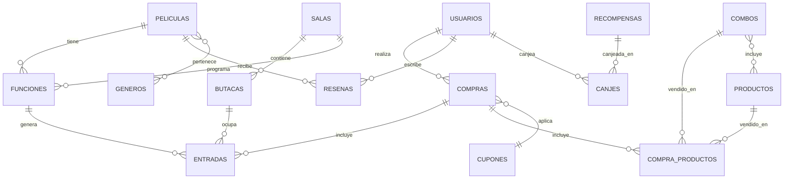

# TP1 - Programación IV - Sistema de Cine

Trabajo práctico de la materia Programación IV: aplicación completa de venta de entradas para un cine (Angular + Supabase + PWA).

## Documentación del proyecto

- [00-modo-de-trabajo.md](00-modo-de-trabajo.md) — cómo se trabaja este TP.
- [01-requerimientos.md](01-requerimientos.md) — requerimientos funcionales extraídos de la consigna.
- [02-sprints.md](02-sprints.md) — planificación por sprints y módulos.

## Código

La aplicación Angular está en [`cine-app/`](cine-app).

```
cd cine-app
npm install
npm start
```

## Arquitectura y decisiones técnicas

**Stack**: Angular 22 (standalone components, Signals, control de flujo nativo `@if`/`@for`/`@switch`, sin NgModules) + Supabase (Postgres, Auth, Realtime) + Vercel (deploy continuo desde `master`) + PWA (service worker de Angular).

**Por qué Supabase y no un backend propio**: la cátedra enseña Angular hablando con un servidor propio vía `HttpClient`. Acá el "backend" es Supabase — Angular habla con `@supabase/supabase-js` directo contra Postgres. La seguridad no depende del código del frontend (cualquiera podría pegarle a la API con Postman) sino de **RLS (Row Level Security)**: cada tabla tiene políticas que Postgres aplica automáticamente sin importar quién ni cómo llegue el pedido.

**Por qué funciones de Postgres (`security definer`) para las operaciones sensibles**: comprar una entrada, cancelarla, canjear puntos o validar un QR necesitan tocar columnas que RLS protege a propósito (puntos, crédito, cupón de bienvenida) y/o requieren que varias tablas se actualicen juntas de forma atómica. En vez de hacerlo con varios `insert`/`update` sueltos desde Angular, esas operaciones viven como funciones de Postgres que primero validan la regla de negocio y recién después escriben — mismo patrón repetido en `confirmar_compra`, `cancelar_compra`, `canjear_recompensa`, `validar_entradas` y `validar_candy` (ver `cine-app/supabase/`).

**Estructura de carpetas** (`cine-app/src/app/`):
- `core/` — servicios singleton, guards, modelos y utilidades puras. Sin UI propia.
- `layout/` — shell de la app: header, footer, sistema de toasts.
- `shared/` — componentes de UI reutilizables entre features (por ahora, el selector de fecha/hora).
- `features/` — un módulo por área funcional (auth, peliculas, compra, perfil, admin/*, empleado), cada uno lazy-loaded con `loadComponent`.

**Base de datos**: los scripts SQL están en `cine-app/supabase/`, uno por sprint (`schema.sql` y `policies.sql` del Sprint 0, después `sprint3.sql` a `sprint9.sql`) — se corren en ese orden en el SQL Editor de Supabase.

### Diagrama de datos (simplificado)



## Estado

- [x] Sprint 0 — Setup y arquitectura ([tp-cine-progra4.vercel.app](https://tp-cine-progra4.vercel.app))
- [x] Sprint 1 — Usuarios y autenticación
- [x] Sprint 2 — Catálogo de películas y salas
- [x] Sprint 3 — Funciones y asignación automática de salas
- [x] Sprint 4 — Selección de butacas y compra de entradas
- [x] Sprint 5 — Candy bar y combos
- [x] Sprint 6 — Cupones y programa de fidelización
- [x] Sprint 7 — Reseñas y "Mis películas"
- [x] Sprint 8 — Panel de administración y reportes
- [x] Sprint 9 — App de empleados
- [ ] Sprint 10 — PWA, UX final y despliegue
